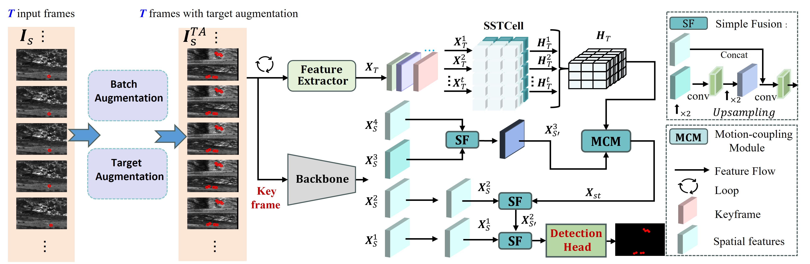

# TSMSA

The Pytorch implementation of the our paper of UESTC-nnLab [**TSMSA: Temporal Segmentation Modeling with Sample Augmentation for Moving
Infrared Small Target Detection**]


## Abstract
Infrared Small Target Detection (IRSTD) has emerged as a critical and hot research topic within the broader field of object detection in recent years. Most sophisticated approaches rely on U-shaped neural networks to address the challenges with small target sizes and low contrast against the background. However, these methods predominantly focus on extracting semantic information from single images and often neglect the temporal relationships across multiple frames. Additionally, the targets in infrared images are typically sparse, leading to issues of insufficient sample data. To address the challenge of temporal modeling in infrared small target segmentation, this paper proposes a new scheme of Temporal Segmentation Modeling with Sample Augmentation (TSMSA). Our temporal data augmentation strategy includes two algorithms: one for target augmentation, randomly cloning target representations over time to generate sufficient training samples, and the other for batch augmentation, further diversifying training
scenes. Moreover, we introduce a Convolutional LSTM-based Network that leverages Long Short-Term Memory (LSTM) cells for temporal modeling, effectively utilizing temporal relationships for improving segmentation. In our TSMSA scheme, we modify a cross-slice ConvLSTM node to capture spatio-temporal features from input video clips. A Motion-Coupling Module is designed o fuse the spatial features of the key frame with the spatio-temporal output from the ConvLSTM node, enhancing the integration of information across both spatial and temporal domains. Finally, the enhanced spatio-temporal features are progressively fused with multi-scale spatial features of the key frame to generate the final feature map.
## Datasets
-MWIRDST and  NUDT-MIRSDT
## Usage
### Train
-Single-frame-based methods
```
CUDA_VISIBLE_DEVICES=0 python train_{dataset}_single.py
```
-Multi-frame-based methods
```
CUDA_VISIBLE_DEVICES=0 python train_{dataset}.py
```
### Test
```
CUDA_VISIBLE_DEVICES=0 python test.py
```
### Comparision method

## Results

## Contact
IF any questions, please contact with Shuang Peng via email: [shuangpeng@std.uestc.edu.cn]().